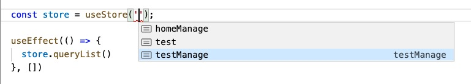
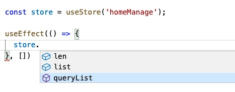

# umi-plugin-mobx-plus

umi mobx 插件。
约定 src 目录下所有 stores 目录下的 (j|t)s 文件都是 model。

* 有 typeScript 提示
* 只有一个 API

## 示例

#### src/stores/homeManage
```typescript
export default {
  list: [],
  get len() {
    return this.list.length
  },
  async queryList() {
    // 网络请求...
    const data = await request... 
    this.list = data;
  }
}
```

#### src/index.ts
```typescript
import React, { useEffect } from 'react'
import { useStore } from 'umi'

function Home() {
  const store = useStore('homeManage');

  useEffect(() => {
    store.queryList()
  }, [])


  return "Hello Umi";
}

export default Home;
```

## TypeScript 提示





## API

`useStore(namespace)`